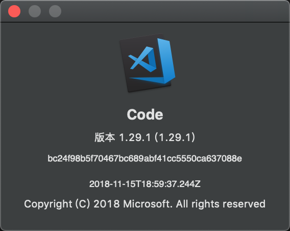
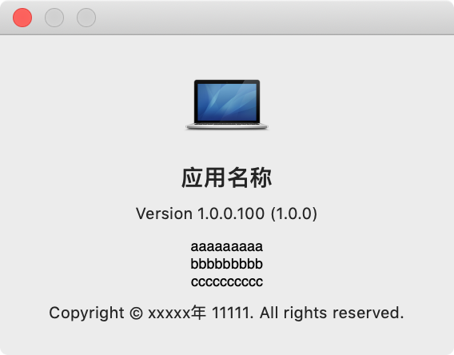
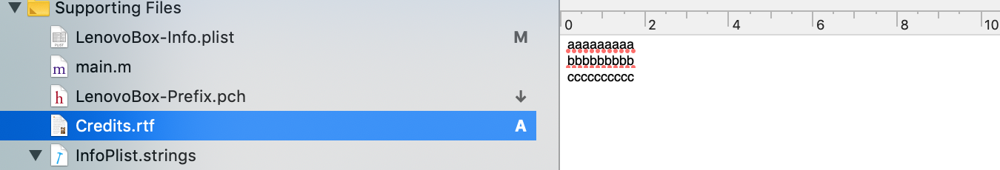
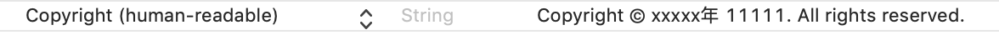
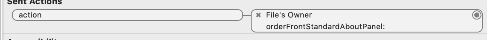
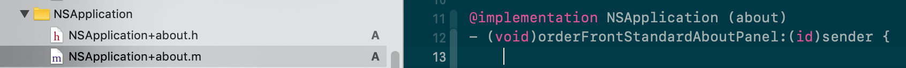

创建新项目的时候系统会自动创建一个显示页面，比如 vs code 的，这都是默认显示的窗口

但是我们想手动调用这个默认窗口的话，系统也提供了一些方法，可以直接显示出来

```objc
- (void)orderFrontStandardAboutPanel:(id)sender;

```
也可以使用下面这个方法设置窗口里面要显示的内容

```objc
- (void)orderFrontStandardAboutPanelWithOptions:(NSDictionary<NSAboutPanelOptionKey, id> *)optionsDictionary;
```
接受参数是一个字典 key 是 `NSAboutPanelOptionKey`

`orderFrontStandardAboutPanel `实现就是调用 `orderFrontStandardAboutPanelWithOptions` 传参 nil 实现的。

具体使用方法 :

<!--More-->

```objc
    NSDictionary *info = @{
//                           NSAboutPanelOptionCredits: attributedString,
                           NSAboutPanelOptionApplicationName:@"应用名称",
                           NSAboutPanelOptionApplicationIcon:[NSImage imageNamed:NSImageNameComputer],
                           NSAboutPanelOptionVersion:@"1.0.0",
                           NSAboutPanelOptionApplicationVersion:@"1.0.0.100"
                           };
```
显示如下图所示：

第一行icon 就是应用图标了，[NSAboutPanelOptionApplicationIcon](https://developer.apple.com/documentation/appkit/nsapplication/1428479-orderfrontstandardaboutpanelwith?language=objc)可以不设置，默认使用的是 `[NSImage imageNamed:@"NSApplicationIcon"]`

第二行应用名称，[NSAboutPanelOptionApplicationName](https://developer.apple.com/documentation/appkit/nsaboutpaneloptionapplicationname?language=objc)，参数字符串。

第三行[NSAboutPanelOptionVersion](https://developer.apple.com/documentation/appkit/nsaboutpaneloptionversion?language=objc)、第四行[NSAboutPanelOptionApplicationVersion](https://developer.apple.com/documentation/appkit/nsaboutpaneloptionapplicationversion?language=objc)

版本信息(内容长了会自动换行，括号里的就理解为第四行吧)，也可以不填，默认显示分别是 `CFBundleVersion` `CFBundleShortVersionString`

第五行，就是上图一长串abc那个，有两种显示方式，当然也可以不设置。
第一种:

```

	NSString *string = @"aaaaaaaaa\nbbbbbbbbb\ncccccccccc";
	
	NSMutableParagraphStyle *paragraphStyle = [[NSMutableParagraphStyle alloc] init];
	
	[paragraphStyle setAlignment:NSTextAlignmentCenter];
	
    NSMutableAttributedString *attributedString = [[NSMutableAttributedString alloc] initWithString:string];
    
    [attributedString addAttribute:NSParagraphStyleAttributeName value:paragraphStyle range:NSMakeRange(0, [string length])];
    
```
通过关键字 [NSAboutPanelOptionCredits](https://developer.apple.com/documentation/appkit/nsaboutpaneloptioncredits?language=objc) 设置value就可以了，这个只接收 NSAttributedString 类型的参数，其他的会报错。

第二种:
在项目中添加名称为Credits.rtf(这个文件也是可以多国语言的)的文件，在里面添加想要添加内容，如下图所示


最后一行 copyright 信息，是读取项目中info.plist的`copyright`字段来显示的，文档上没有提及单独设置的地方。




最后 MainMenu.xib 默认创建出了关于的item 并且绑定了事件

我们可以重新绑定个事件，做自己的操作，也可以添加个 NSApplication 的类别，重写 `- (void)orderFrontStandardAboutPanel:(id)sender;` 方法



> - [NSAboutPanelOptionApplicationIcon](https://developer.apple.com/documentation/appkit/nsapplication/1428479-orderfrontstandardaboutpanelwith?language=objc)
> - [NSAboutPanelOptionApplicationName](https://developer.apple.com/documentation/appkit/nsaboutpaneloptionapplicationname?language=objc)
> - [NSAboutPanelOptionApplicationVersion](https://developer.apple.com/documentation/appkit/nsaboutpaneloptionapplicationversion?language=objc)
> - [NSAboutPanelOptionCredits](https://developer.apple.com/documentation/appkit/nsaboutpaneloptioncredits?language=objc)
> - [NSAboutPanelOptionVersion](https://developer.apple.com/documentation/appkit/nsaboutpaneloptionversion?language=objc)

只支持10.13以上
# 参考
- https://developer.apple.com/documentation/appkit/nsapplication/1428724-orderfrontstandardaboutpanel?language=objc
