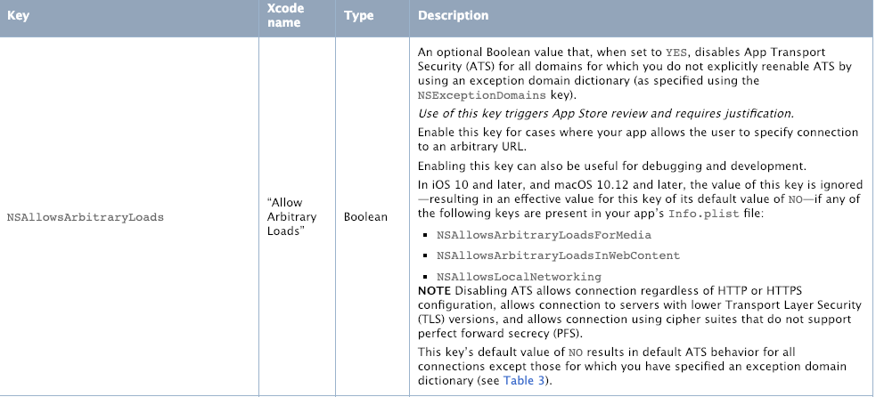
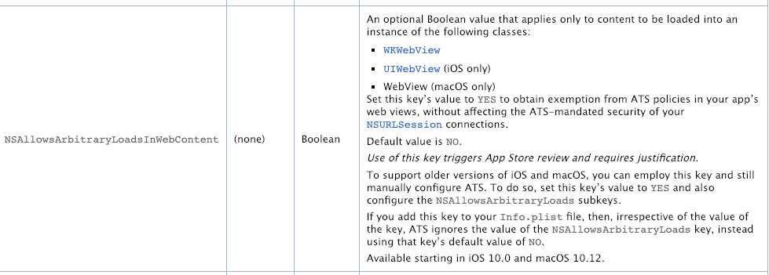

前几日，同事 CM 合并代码后，运行工程，网络报错 ATS `code = -1022` `The resource could not be loaded because the App Transport Security policy requires the use of a secure connection.` 可是项目中`info.plist`已经添加了 `NSAllowsArbitraryLoads` ,网上查找了一大圈还是没有解决问题， CM 尝试删除了 info.plist 中另一个 key `NSAllowsArbitraryLoadsInWebContent
` 居然神奇的好用了。

赶紧查文档，文档上就有说明

很清楚了在 iOS 10 和 macOS 10.12 以后，只要写了 `NSAllowsArbitraryLoadsForMedia` `NSAllowsArbitraryLoadsInWebContent` `NSAllowsLocalNetworking` 这个三个中任何一个 `NSAllowsArbitraryLoads` 默认就为 NO 了，不管你设置的啥。

# 参考
- [https://developer.apple.com/library/archive/documentation/General/Reference/InfoPlistKeyReference/Articles/CocoaKeys.html#//apple_ref/doc/uid/TP40009251-SW68](https://developer.apple.com/library/archive/documentation/General/Reference/InfoPlistKeyReference/Articles/CocoaKeys.html#//apple_ref/doc/uid/TP40009251-SW68)
- [https://www.nowsecure.com/blog/2017/08/31/security-analysts-guide-nsapptransportsecurity-nsallowsarbitraryloads-app-transport-security-ats-exceptions/](https://www.nowsecure.com/blog/2017/08/31/security-analysts-guide-nsapptransportsecurity-nsallowsarbitraryloads-app-transport-security-ats-exceptions/)
- [https://forums.developer.apple.com/message/198714#198714](https://forums.developer.apple.com/message/198714#198714)
- [https://swiftcafe.io/2016/09/20/ats/](https://swiftcafe.io/2016/09/20/ats/)
- [https://www.jianshu.com/p/236533b921a3](https://www.jianshu.com/p/236533b921a3)
