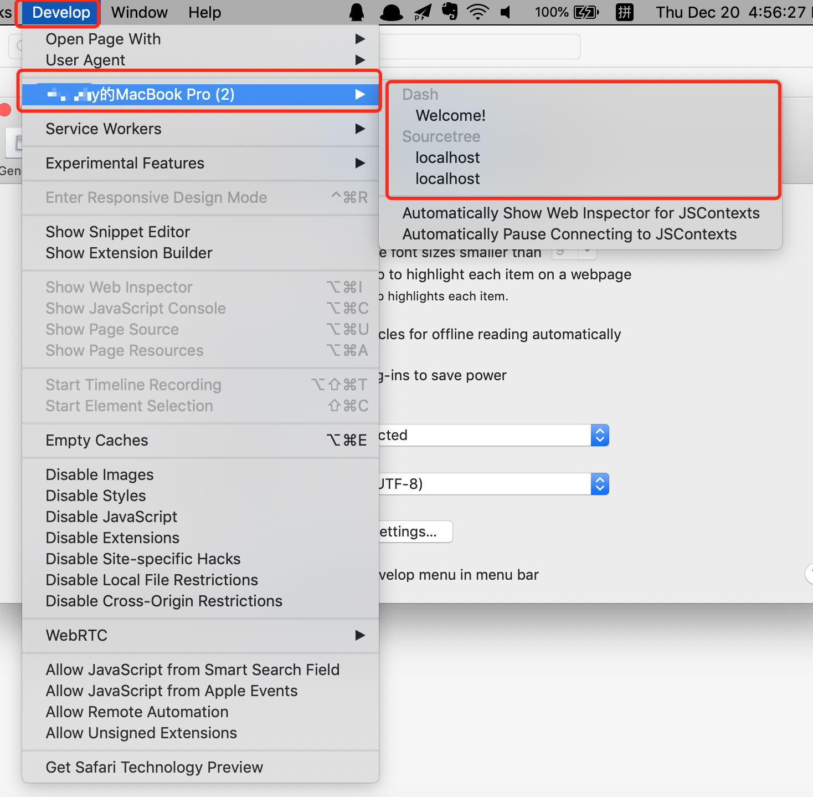

# mac 上调试应用的 Webview 界面

### 开启方式
safari 开启 Preferences -> Advanced ->Show Develop menu in menu bar

### 运行方式

Debug 模式下直接就能显示出来，选中就可以开始调试了。

但是在 Release 模式下，比如给前端开发的测试包，就没法使用了。在 Xcode 工程中的 `LenovoBox.entitlements` 文件中添加下面两行
```xml
    <key>com.apple.security.get-task-allow</key> 
    <true/>
```

